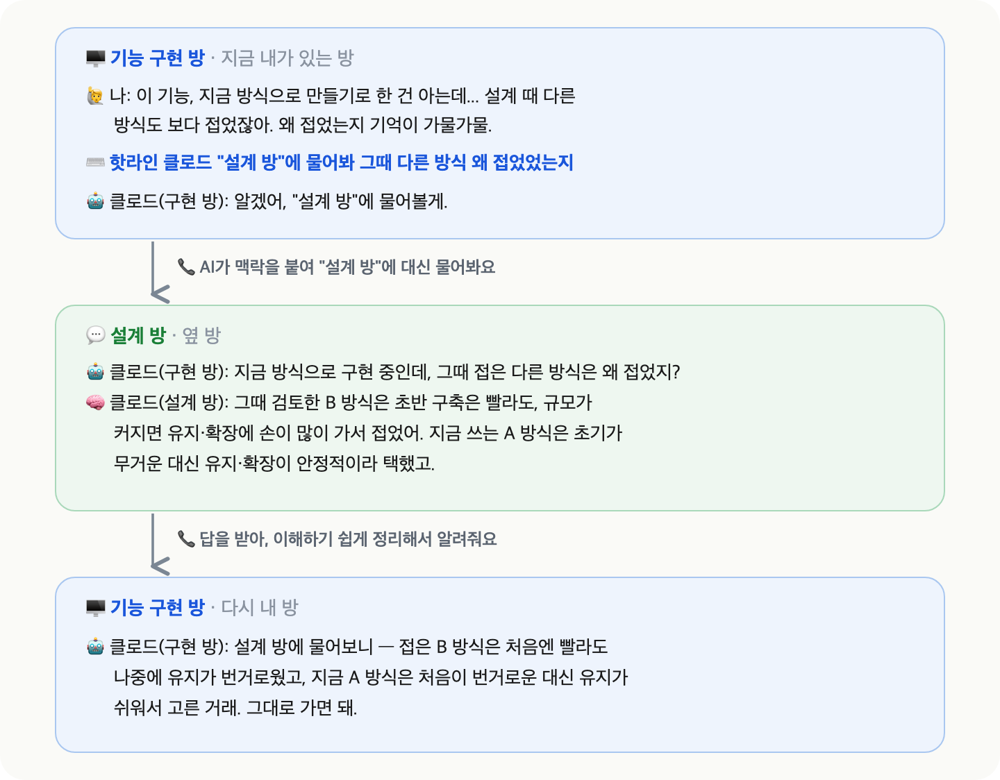
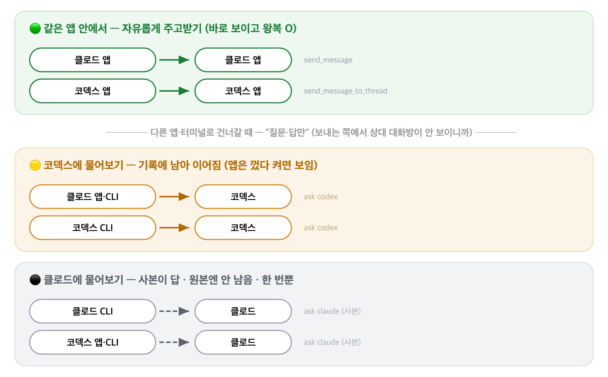

# 📞 핫라인 (session-hotline)

> **다른 AI 대화방에 직통으로 물어보기** — Claude Code·Codex의 여러 대화방끼리 서로 묻고 답하게 하는 스킬이에요.

> 🖥️ **macOS + Claude Code·Codex 데스크탑 앱** 환경을 중심으로 만들고 검증했어요(두 앱이 기본 제공하는 기능을 활용해요). 다른 환경(Windows·Linux)은 동작을 보장하지 않아요 — 자세한 건 아래 **유의사항**을 봐주세요.

---

## 🎯 이런 순간에 써요

여러 대화방에 나눠 작업하다 보면(설계 방 따로, 구현 방 따로), 지난 방에서 뭘 정했는지·왜 그랬는지 가물가물할 때가 있어요. 예전엔 그 방을 **직접 열어 뒤지고 → 복사해 → 지금 방에 다시 설명**해야 했죠.

> 💡 **이제는 지금 대화방에서 질문만 하면, AI가 그 방에 대신 물어보고 답을 정리해줘요.**

내가 옮겨 적을 필요도, 맥락을 구구절절 다시 설명할 필요도 없어요 — 그 방 AI가 **자기 맥락 전체를 근거로** 답하니까요. **클로드 방 ↔ 코덱스 방**을 넘나들며 물어볼 수도 있고요.

> 🤔 그냥 복붙하면 되지 않냐고요? 복붙은 **내가 어디에 답이 있는지 찾아서 골라야** 하지만, 핫라인은 궁금한 걸 말로 물으면 그 방 AI가 **알아서 자기 기록을 뒤져** 찾아줘요.

## 💬 쓰는 방법 — 한 문장이면 돼요

```
핫라인 클로드 "설계 방"에 물어봐 그때 다른 방식 왜 접었었는지
```

문장은 이렇게 구성돼요:

| 조각 | 역할 | 예시 |
|---|---|---|
| `핫라인` | 스킬 발동 신호(고정) | 핫라인 |
| `클로드` 또는 `코덱스` | **어느 앱의 대화방**에 물을지 | 클로드 |
| `"대화방 제목"` | 대상 — 제목을 **그대로 복붙**(이모지까지) | "설계 방" |
| `물어봐 질문` | 물어볼 내용 | 그때 다른 방식 왜 접었었는지 |

> 💡 **대화방 제목**은 클로드·코덱스 앱 **왼쪽 목록에 보이는 제목**을 그대로 복사하면 돼요(이모지까지). 제목이 헷갈려도 괜찮아요 — 보내기 전에 AI가 "이 대화방 맞아?"라고 다시 확인해요.

> 💡 **대충 말해도 괜찮아요** — "그때 그거 왜 그렇게 정했지?"처럼 짧게 물어도, AI가 지금 방에서 오간 맥락을 붙여 대상 방이 알아듣게 다듬어 물어봐요. 돌아온 답도 그대로 던지지 않고 **이해하기 쉽게 정리해서** 알려주고요.

실제로 쓰면 이런 흐름이에요:



> 아직 설치 전이라면, 아래 **준비물 → 설치**부터 하고 돌아와 주세요.

## 📋 설치 전 준비물

- **같은 앱 안에서만** 쓸 거면(클로드 방끼리, 코덱스 방끼리) → **그 앱 하나만** 있으면 돼요.
- **다른 앱에도 물어보려면**(클로드 ↔ 코덱스) → **각 앱이 터미널(CLI, 명령줄)에 설치돼 있고 로그인도 돼 있어야** 해요(다른 앱 경로는 터미널로 도니까요 — 그 앱 구독으로 평소처럼 쓸 수 있는 상태면 돼요). 터미널을 몰라도 괜찮아요, 바로 아래를 봐주세요.

**터미널을 몰라도 괜찮아요** — 아래 문장을 클로드나 코덱스 채팅창에 그대로 붙여넣으면, AI가 확인부터 설치·로그인 안내까지 대신 해줘요:

```
내 터미널에 Claude Code(claude)와 Codex(codex) 두 CLI가 설치돼 있고 각각 로그인돼 있는지 확인해줘. claude·codex 명령이 실제로 실행되는지, 로그인 상태인지까지 봐주고 — 안 깔려 있으면 설치를, 로그인이 안 돼 있으면 로그인을 단계별로 안내해줘.
```

> 💡 본인이 직접 할 건 딱 하나 — **로그인 창이 뜨면 "허용" 클릭**이에요(계정 인증이라 이 클릭만은 AI가 대신 못 눌러요).

> 💡 그 밖에 필요한 것(Python 같은 내부 도구)은 설치 마지막에 **자가진단(doctor)이 자동으로 확인**해서, 없으면 알려줘요 — 미리 챙길 필요 없어요.

> 🔎 **고급** — 설치 점검(doctor)은 앱·명령이 있는지는 봐도 **로그인 여부까지는 못 봐요**. 다른 앱에 물었는데 답이 없으면 로그인부터 확인하세요(터미널: `claude auth status` · `codex login status`).

## ⚡ 설치 (셋 중 하나만)

### 방법 1 — 왕초보용: 이 한 줄을 AI한테 붙여넣기 (추천)

클로드 또는 코덱스 채팅창에 아래 한 줄을 그대로 복붙하세요:

```
https://github.com/oimoaoa/session-hotline 이 주소의 스킬이 뭔지 파악해서 나한테 쉬운 말로 설명해주고, 내 환경에 맞게 설치해줘.
```

AI가 내용을 읽고, 뭐가 설치되는지 설명해 주고, 설치까지 도와줘요. 중간에 **macOS 권한 승인 창이 뜰 수 있는데 정상**이에요. 혹시 실패하면 그 **에러 메시지를 그대로 AI에게** 보여주면 돼요.

### 방법 2 — 터미널 복붙 (git clone 방식)

```bash
git clone https://github.com/oimoaoa/session-hotline.git ~/session-hotline && bash ~/session-hotline/install.sh
```

저장소를 내 컴퓨터에 내려받고, 설치 스크립트가 **내 컴퓨터에 깔린 앱**(클로드·코덱스 중 있는 쪽)에 자동 등록해요 — 한쪽만 있으면 그쪽에만 등록하고 넘어가요. 마지막에 자가진단(doctor)까지 돌려서 준비 상태를 알려줘요.

### 방법 3 — 수동 설치

<details>
<summary>펼쳐서 보기</summary>

1. 이 저장소를 아무 데나 clone(내려받기)
2. `hotline.sh`와 `resolve_claude.py`·`resolve_codex.py` **세 파일을 같은 폴더** `~/.session-hotline/`로 복사하고, `hotline.sh`에 실행 권한 부여(`chmod +x`) — resolve 파일 둘이 있어야 대화방을 제목으로 찾아요
3. `skills/SKILL.md`를 `~/.claude/skills/session-hotline/SKILL.md`로 복사(Claude Code용)
4. 같은 파일을 `~/.codex/skills/session-hotline/SKILL.md`로 복사(Codex용)

</details>

> **고급 사용자용** — 클론해서 본인 환경에 맞게 커스텀해도 돼요. 재설치할 때 기존 파일과 다르면 스킬·스크립트 모두 자동으로 백업(`파일명.backup-날짜`)을 만들어서, 손댄 내용이 조용히 사라지지 않아요.

## 🚀 첫 사용 (1분)

1. 설치가 끝나면 AI가 **doctor**(1초짜리 자가진단 — 준비됐는지 점검)를 돌려 "준비 완료"를 보여줘요. 안 뜨면 "doctor 돌려줘"라고 하세요.
2. 아무 대화방에서 이렇게 입력해요. 처음엔 **같은 앱끼리**가 제일 쉬워요 — 클로드 앱이라면: `핫라인 클로드 "대화방 제목"에 물어봐 궁금한 것` (코덱스 앱이라면 `핫라인 코덱스 ...` — 다른 앱에 물으려면 위 준비물의 로그인이 먼저 돼 있어야 해요)
3. 보내기 전 AI가 "이 대화방 맞아?"(제목·id·수정시각)를 한 번 되물어요 — 맞다고 확인해 주면 전송돼요.
4. **권한 승인 창이 뜨면 승인**하세요(정상이에요 — AI가 대신 명령을 실행하려면 거치는 확인 절차예요). 그럼 답이 돌아와요.

## 🗺️ 같은 앱 vs 다른 앱 — 뭐가 다른가

👉 **한마디로 — 같은 앱끼리는 자유롭게 왕복, 다른 앱으로는 질문·답만.** 아래에서 하나씩 볼게요.

핫라인은 "**보이는 만큼 자유**"로 움직여요. 내가 결과를 눈으로 볼 수 있는 범위(=같은 앱)에서는 자유롭게 주고받고, 안 보이는 범위(=다른 앱)에서는 실수로 사고 안 나게 "**질문·답만**" 하도록 제한해 두었어요.



- **같은 앱 안**(클로드 방 ↔ 클로드 방, 코덱스 방 ↔ 코덱스 방): 앱이 원래 가진 기능으로 **자유롭게 주고받아요**. 메시지가 상대 대화방 화면에 진짜 도착해서 다 확인돼요(알림을 켜뒀다면 알림도 떠요).
- **다른 앱으로 건너갈 때**(클로드 → 코덱스, 코덱스 → 클로드): 두 앱은 **화면이 서로 분리돼 있어서**, 지금 앱에서는 상대 대화방이 어떻게 됐는지 **눈으로 바로 확인할 수 없어요**. 안 보이는 곳에서 남의 대화방을 건드리면 실수로 그쪽 작업에 끼어들어 영향을 줄 수 있으니, "**질문하고 답 듣기**"로만 제한해 두었어요(상대는 읽고 답만, 내 파일은 못 고쳐요).

다른 앱으로 건너갈 때(또는 터미널에서 걸 때) **클로드와 코덱스는 방식이 조금 달라요**:

- **코덱스에 물으면** — 질문이 그 대화방 기록에 남아서 **나중에 이어서** 물어볼 수 있어요(대신 상대 기록에 흔적이 남고, 앱은 껐다 켜야 보여요).
- **클로드에 물으면** — 그 대화방 내용을 복사한 **읽기 전용 사본**이 대신 답해요. 원본 대화방은 안전하게 그대로 두고 건드리지 않아요(원본은 이 일을 몰라요). 대신 물을 때마다 **새 사본**이 답하기 때문에, 이전 질문을 기억 못 하고 **매번 처음처럼**(한 번 묻고 끝) 답해요.
- 한 줄 요약(**다른 앱·터미널에서 건너갈 때**): 클로드에 물으면 = 원본을 안 건드리는 대신 한 번뿐 · 코덱스에 물으면 = 이어서 물을 수 있는 대신 그 방 기록에 질문이 남음.

> 헷갈리지 마세요 — **같은 앱끼리**(클로드 ↔ 클로드, 코덱스 ↔ 코덱스)는 위 "**같은 앱 안**" 설명대로 **원본에 바로 도착하고 왕복**돼요. "사본·한 번뿐"은 *다른 앱·터미널로 건너갈 때만*이에요.

> **고급 사용자용** — 터미널(CLI)에서도 직접 걸 수 있어요. 앱끼리 직접 못 건너가서 터미널을 다리로 빌리는 경로라, 같은 "질문·답만" 제약이 걸리고 환경에 맞게 커스텀할 수 있어요.

### 경로별 자세히 — 뭐가 되고 안 되나

> 🟢 **같은 앱**(자유 왕복) · 🟡 **코덱스에**(이어짐) · ⚫ **클로드에**(사본·한 번뿐)

| 무엇을 할 수 있나 | 같은 앱끼리<br>🟢 | 다른 앱에서<br>코덱스에 🟡 | 다른 앱·CLI에서<br>클로드에 ⚫ |
|---|:---:|:---:|:---:|
| 대화방에 **질문하기** | ✅ | ✅ | ✅ |
| **앱 화면에서** 상대 대화방 확인 | ✅ 바로 | △ 껐다 켜면 | ❌ 안 남음 |
| 이전 문답 기억·**이어서 질문** | ✅ | ✅ | ❌ 한 번뿐 |

*같은 앱끼리 = 클로드 ↔ 클로드, 코덱스 ↔ 코덱스*.

## 🛡️ 안전장치

안전한 사용을 위해 여러 제한을 걸어 뒀어요.

| 장치 | 뭘 막나 | 어떻게 막나 |
|---|---|---|
| **보내기 전 되물어보기**<br>(echo-back) | 엉뚱한 대화방에 잘못 보내기 | 전송 전 "이 대화방 맞아?"(제목·id·수정시각)를 되물어 사용자 확인을 받아요 |
| **읽기 전용**<br>(read-only, 다른 앱으로 보낼 때) | 상대 대화방이 내 파일을 수정하는 것 | 상대에게 **읽기 권한만** 주고 쓰기·수정은 빼서, 읽고 답만 하게 해요 |
| **비밀번호·키 걸러내기**<br>(시크릿 스캔) | API 키·비밀번호가 질문에 섞여 상대 기록에 남는 것 | 보내기 전 AI가 점검 도구(scan)로 질문을 훑어 — 키 형식이 보이면 **차단하고 알려줘요** |
| **무한 반복 막기**<br>(재귀 차단) | 상대 대화방이 또 핫라인을 걸어 요금이 눈덩이처럼 부는 것 | 핫라인이 또 핫라인을 부르지 못하게 막아요(건너가는 경로는 스크립트가 차단, 같은 앱 안은 안내 문구로 차단) |
| **기록 남기기 전 확인**<br>(다른 앱으로 코덱스에 물을 때) | 코덱스 대화방 기록에 남는 동작을 확인 없이 실행하는 것 | 코덱스에 물으면 원본 기록에 남으므로, 확인이 없으면 **스크립트가 거부**해요. (다른 앱·CLI로 **클로드**에 물을 땐 사본이 답해 원본에 안 남아요.) |
| **자가진단**<br>(doctor) | 앱 업데이트로 내부 구조가 바뀌어 조용히 작동하지 않는 것 | 설치 직후·처음 쓸 때·이상할 때 필요한 도구·기능을 점검해, 비정상 작동하면 알려줘요 |

## ⚠️ 유의사항

**먼저 알아둘 것 3개** — ① **macOS에서만** 검증했어요. ② **다른 앱·CLI에서 클로드에게** 물으면 사본이 한 번만 답해요(이어짐 없음). ③ **Claude Code·Codex 데스크탑 앱 업데이트로 비정상 작동할 수 있어요**(그럼 doctor가 알려줘요).

- **macOS 전용** — macOS에서만 만들고 검증했어요. 스크립트가 macOS 명령 기준이라 다른 OS에선 수정 없이 안 돌아가요(설치 때 명확히 막혀요).
- **권한 승인 창이 뜨는 건 정상이에요** — AI가 대신 도구·명령을 실행할 때 거치는 확인 절차예요(위험한 게 아니라 정상). 그냥 **승인**하면 진행돼요. 상황에 따라 여러 번 뜰 수 있고(특히 **코덱스**는 보내기·실행 단계에서 한 번 더 물을 수 있어요), 앱·환경 설정에 따라 아예 안 뜨기도 해요. 고장이 아니에요.
- **로그인은 doctor가 못 잡아요** — doctor는 필요한 파일·명령을 점검하지만, 클로드·코덱스에 **실제로 로그인·구독이 살아있는지는 못 봐요**. 다른 앱 경로가 조용히 안 되면 로그인부터 확인하세요.
- **읽기 전용(read-only)의 정확한 뜻** — 상대는 읽고 답은 하지만, **파일을 만들거나 고칠 권한은 없어요**. 그래서 "여기에 저장해줘"는 안 되고 **초안만** 줘요(정상 동작). 단, 막는 건 "파일 수정"까지예요 — 인터넷 접속이나 그 대화방에 연결된 외부 도구(MCP 커넥터)까지는 완전히 막지 못하니, 아주 민감한 대화방은 자문을 신중히 하세요.
- **시크릿 스캔은 안전망이지 보장이 아니에요** — 흔한 키 형식(OpenAI·Anthropic·AWS·GitHub·Slack·Google·Stripe·JWT·DB 접속주소 등)은 상당수 잡아주지만, **미지의·사내 커스텀 형식은 못 잡을 수 있어요**. 애초에 비밀번호·키는 질문에 넣지 마세요.
- **다른 앱(코덱스 등)에서 클로드에게 물으면 한 번뿐이에요** — 사본이 그때만 답하고 이전 문답을 기억 못 해요. (**같은 클로드끼리** 물으면 원본 대화방에 남아 이어져요.)
- **코덱스에 물으면 질문이 그 대화방 기록에 영구히 남아요** — 그러니 **비밀번호·API 키 같은 민감한 값은 질문에 넣지 마세요**. 자동으로 걸러주는 장치(시크릿 스캔)가 있지만 완벽하진 않아요.
- **아주 긴 대화방은 시간·요금이 더 들어요** — 대상 대화방의 대화 전체를 읽고 답하기 때문이에요(답까지 몇 초 ~ 십몇 초 더 걸릴 수 있어요). 여기서 요금은 따로 청구되는 게 아니라, **쓰던 구독·계정의 사용량이 그만큼 더 소모**된다는 뜻이에요.
- **비공식 내부 저장 방식에 의존해요** — Claude Code·Codex 데스크탑 앱 업데이트로 언제든 비정상 작동할 수 있고, 그러면 doctor가 알려줘요.
- **핫라인을 아주 가벼운 AI 모델(Haiku급)로 돌리면 "보낸 앱" 표기가 틀릴 수 있어요** — 받는 대화방에 뜨는 *보낸 쪽 앱 이름*(클로드·코덱스)만 틀리게 적힐 수 있고, **질문·답·대화방 내용은 정확**해요. 모델을 일부러 바꾸지 않으면 겪을 일이 거의 없고, 정확도가 중요하면 기본 모델(Sonnet급 이상)을 쓰세요.

## 🔧 문제 해결

| 증상 | 원인과 해결 |
|---|---|
| **다른 앱**에 물었는데 답이 아예 안 옴 | 상대 앱(코덱스·클로드)이 **설치·로그인**돼 있는지 먼저 확인(위 "설치 전 준비물" 참고) |
| "대화방을 못 찾음" | 제목을 정확히(이모지 포함) 복붙했는지 확인. 못 찾으면 AI가 후보를 보여줄 수 있어요 — 임의로 다시 보내지 말고 "이 대화방 맞아?" 물을 때 골라주세요 |
| **다른 앱**(코덱스)에 물었는데 그 화면에 바로 안 보임 | 기록엔 남아 있어요 — 그 앱을 완전히 껐다 켜면 보여요(정상) |
| 답이 안 오고 오래 걸림 | 아주 큰 대화방일 수 있어요 — 잠깐 기다려 보고, 계속 안 되면 에러를 AI에게 보여주세요. (고급: `HOTLINE_TIMEOUT`으로 대기시간 조정, 기본 300초) |
| 코덱스에서 실행이 실패함 | 권한 승인 창이 뜨면 승인하고 재시도 — AI가 안내해요 |
| 같은 앱끼리 보냈는데 회신이 안 옴 | 회신은 상대 대화방의 응답 + 사용자 승인이 둘 다 필요해요. 안 오면 그 대화방을 직접 열어 확인 |

> 💬 **호출이 실패하면? — AI에게 물어봐 주세요**. 제작자의 맥북 환경에서 겪은 CLI 시행착오를 최대한 적용한 스크립트지만, 환경에 따라 실패할 수 있어요. 그럴 땐 그 에러 메시지를 그대로 AI(클로드·코덱스)에게 보여주고 "내 환경에 맞게 고쳐줘"라고 말해 보세요.

## 🛠️ 고급 — 직접 다루기 (터미널 사용자용)

핵심은 `~/.session-hotline/hotline.sh` 하나예요. 서브커맨드:

```bash
bash ~/.session-hotline/hotline.sh doctor                       # 자가진단
bash ~/.session-hotline/hotline.sh resolve claude "대화방 제목"   # 클로드 대화방 찾기 → JSON
bash ~/.session-hotline/hotline.sh resolve codex  "대화방 이름"   # 코덱스 대화방 찾기 → JSON
bash ~/.session-hotline/hotline.sh scan <질문파일>                # 시크릿 점검 (발견 시 종료코드 1)
HOTLINE_CONFIRM=1 bash ~/.session-hotline/hotline.sh ask codex <ID> <질문파일>   # 코덱스에 질문 — 원본 기록에 남아서 확인 플래그 필수
bash ~/.session-hotline/hotline.sh ask claude <UUID> <작업폴더> <질문파일>        # 클로드에 질문 — 읽기 전용 사본이 답함
```

환경변수는 전부 선택이고, 기본값이 표준 설치 기준이에요:

| 변수 | 뜻 | 기본값 |
|---|---|---|
| `HOTLINE_TIMEOUT` | 답변 대기 시간(초) | `300` |
| `CLAUDE_BIN` / `CODEX_BIN` | CLI 실행 파일 경로 직접 지정 | PATH에서 탐색(+폴백) |
| `HOTLINE_CLAUDE_PROJECTS` | 클로드 세션 저장소 | `~/.claude/projects` |
| `HOTLINE_CLAUDE_DESKTOP_STORE` | 클로드 데스크탑 앱 저장소(자동 제목 검색원) | `~/Library/Application Support/Claude/claude-code-sessions` |
| `HOTLINE_CODEX_INDEX` | 코덱스 대화방 이름 인덱스 | `~/.codex/session_index.jsonl` |
| `HOTLINE_CODEX_SESSIONS` | 코덱스 세션 기록 폴더 | `~/.codex/sessions` |

## 🗑️ 제거 방법

설치되는 곳은 세 군데예요. 아래 한 줄로 흔적 없이 제거돼요(내려받은 저장소 폴더는 따로 지우세요):

```bash
rm -rf ~/.session-hotline ~/.claude/skills/session-hotline ~/.codex/skills/session-hotline
```

## 🧪 검증 버전

공개 직전 실환경에서 자가진단(doctor)까지 통과 확인한 버전이에요:

- Claude Code `2.1.203` · Codex `0.142.5` · Python `3.14.6` · macOS
- 기준일: 2026-07-08

> **doctor가 뭐예요**? 상주 프로그램이 아니라 `hotline.sh`에 든 **1초짜리 점검 기능**이에요. 설치 직후와 스킬을 처음 쓸 때(또는 뭔가 이상할 때)만 돌아서, 필요한 도구·기능이 다 있는지 확인하고 결과만 보여줘요. 앱 업데이트로 내부 구조가 바뀌면 여기서 잡아줘요.

## 라이선스

MIT License. See [LICENSE](LICENSE).
